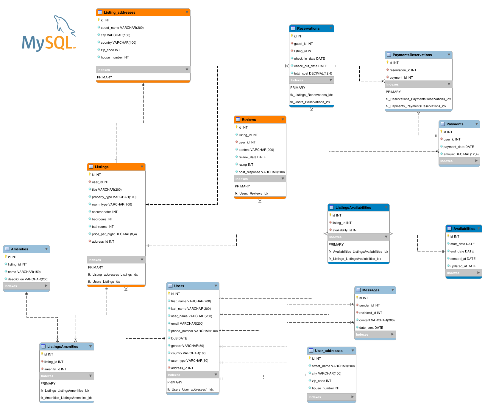
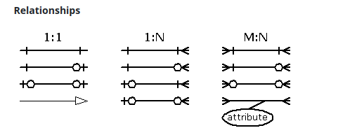

# A Use-Case of booking a hotel room:Airbnb

Refer to the document `Assignments-Portfolio_DLBDSPBDM01-2.pdf` for more info about the database development.


## Database creation using docker

If you don't want to create the databse you can skip this part and jump into the section [How to Dockerize the MySQL Database?](#how-to-dockerize-the-mysql-databaseREADME.md). Clone the repository to your local machine, then navigate to the project folder and to the `database_creation` folder. 
Run the following command to create a Docker container named "mysql-c1" with MySQL 8.0

```
docker run -d \
  --name mysql-c1 \
  -v "$(pwd):/app" \
  -e MYSQL_ROOT_PASSWORD=secret \
  -e MYSQL_DATABASE=todos \
  mysql:8.0
```
* docker run: Initiates the creation and execution of a new Docker container.
* -d: Runs the container in detached mode, meaning it runs in the background.
* --name mysql-c1: Assigns the name "mysql-c1" to the Docker container, allowing you to reference it by this name.
* -v "$(pwd):/app": Mounts the current working directory on the host machine ($(pwd)) to the /app directory inside the container.
* -e MYSQL_ROOT_PASSWORD=secret: Sets the environment variable MYSQL_ROOT_PASSWORD inside the container to "secret". 
* -e MYSQL_DATABASE=todos: Sets the environment variable MYSQL_DATABASE inside the container to "todos". 
* mysql:8.0: Specifies the Docker image to use for creating the container. In this case, it uses the official MySQL 8.0 image from the Docker Hub.

Once the container is up and running, log into it:

```
docker exec -it mysql-c1 sh
```

Go to `app` folder and execute the SQL scripts one by one. You will prompted to
insert the password each time:

```
mysql -u root -p < create_tables.sql
```

```
mysql -u root -p < add_primary_keys.sql
```


```
mysql -u root -p < add_foreign_keys.sql
```

You can log into the data_mart_airbnb database to check whether the tables 
have been created and constraints have been added:

```
mysql -u root -p
```

```
use data_mart_airbnb;
```

```
show tables;
show create table `<yourtable>`;
```

`show tables` will list all the tables present in the `data_mart_aibnb`, while `show create table <yourtable>` will show all the information about the columns, their data types, constraints (e.g., PRIMARY KEY).

Execute the script `run_all_scripts.sh` that will do the following things:
1. Install necessary Python packages (pandas, SQLAlchemy, etc.).
2. Create the CSV files for each table
3. Fill tables using data in the csv files:

Finally, create a MySQL dump of the database: 

```
mysqldump -u root -p data_mart_airbnb > data_mart_airbnb.sql
```

The file will be visible in your current directory because we established a 
link between this directory and the directory within the container.


## Conception phase 
The definition of tables, their structures, and the constraints adhered to a well-thought-out process. If you are curious, feel free to explore the details below. 




This detailed Entity-Relationship Diagram (ERD) model provides a segment of our database model designed for the Airbnb use case. The squares represent our entities, each populated with attributes relevant to the respective entities. The arrows between the squares indicate how the entities relate to one another.




## How to Dockerize the MySQL Database?


 When aiming to construct an application stack comprising multiple componentes, it is advisable to leverage Docker Compose. Take a look at the current state of our root directory. Remember this folder structure, as it will prove valuable in the subsequent steps

```
├── database_creation
    |-- add_foreign_keys
    |-- add_primary_keys
    |-- .....
    |-- ...
├── db
    |-- database_datamart-airbnb
```

Below is the YAML file definition for this configuration:

```
services:
  mysqlc1:
    image: mysql
    ports:
     - "127.0.0.1:3306:3306"
    volumes: 
     - ./db/data_mart_airbnb.sql:/docker-entrypoint-initdb.d/data_mart_airbnb.sql
    environment:
      MYSQL_ROOT_PASSWORD: root
      MYSQL_DATABASE: data_mart_airbnb
```

* services: This is a key indicating the start of the service definitions. In container orchestration tools like Docker Compose, a service represents a containerized application or a microservice.

* mysqlc1: This is the name of the service. 

* image: mysql: Specifies the Docker image to use for this service. 

* ports: Specifies the port mapping, indicating that port 3306 on the host machine (127.0.0.1) should be mapped to port 3306 in the container. This allows you to access the MySQL service running inside the container from your host machine.

* volumes: Mounts a local file (./db/data_mart_airbnb.sql) into the container at /docker-entrypoint-initdb.d/data_mart_airbnb.sql. This is used to initialize the MySQL database with custom SQL scripts at startup.

* environment: Sets environment variables for the MySQL container. 


To verify the status of the database container, you can check its accessibility by creating another container within the same network using the following command:

```
docker run -it --network data-mart-airbnb_default \
--rm nicolaka/netshoot dig data-mart-airbnb-mysqlc1-1
```

This command resolves the hostname and retrieves the IP address of the specified container. 

If you wish to determine whether the database is also externally exposed, you could also use the following python function:


```
import mysql.connector

def getConn(host,user,password,db):
    cnx = mysql.connector.connect(
        host=host,
        user=user,
        password=password,
        db=db
    )
    return cnx 
```

##  Integrating the Flask API

To connect the Flask API to the database, examine the current state of our root directory. Two crucial folders are `py-api` and `db`. The `py-api` folder holds the source code, while the `db` folder is essential as it serves as the source for mounting the `data_mart_airbnb.sql` file into the MySQL container during initialization.

```
├── py-api
│   ├── Dockerfile
│   ├── app.py
│   ├── listings_filter.py
│   ├── requirements.txt
│   └── templates
│       ├── filter_location.html
│       ├── filter_price.html
│       ├── filter_rating.html
│       ├── filter_results.html
│       └── menu.html
├── db
│   ├── data_mart_airbnb.sql

```


Below is the YAML file definition for this configuration:

```
services:
  api:
    build: ./py-api
    ports:
     - "127.0.0.1:8080:5000"
    environment:
      MYSQL_HOST: ${MYSQL_HOST}
      MYSQL_ROOT_PASSWORD: ${MYSQL_ROOT_PASSWORD}
      MYSQL_DATABASE: ${MYSQL_DATABASE}
      MYSQL_USER: ${MYSQL_USER}
  mysqlc1:
    image: mysql
    ports:
     - "3306"
    volumes: 
     - ./db/data_mart_airbnb.sql:/docker-entrypoint-initdb.d/data_mart_airbnb.sql
    environment:
      MYSQL_ROOT_PASSWORD: ${MYSQL_ROOT_PASSWORD}
      MYSQL_DATABASE: ${MYSQL_DATABASE}   
```


For a more secure version, create a file called `.database-cred` in the current working directory and add the environment variables:

```
MYSQL_HOST=<your_hostname>
MYSQL_ROOT_PASSWORD=<your_password>
MYSQL_DATABASE=<your_database>
MYSQL_USER=<your_user>
```

## Run the application stack
Run the following command to reference the environment variables defined in your .database-cred without having to source it explicitly:

```
docker-compose -f db-api-compose.yaml --env-file .database-cred up -d
```

You can tear it all down by running the following command:


```
docker-compose -f db-api-compose.yaml down
```

### Endpoints available in the Flask Api

* GET /filter/rating: Filters listings based on a minimum rating.
* GET /filter/price: Filters listings based on a price range.
* GET /filter/location: Filters listings based on a location (city).
* POST /create/users: Create a new user.

### Example Usage

Test your endpoints using:

```
curl -v localhost:8080/filter/rating
curl -v localhost:8080/filter/price
```
